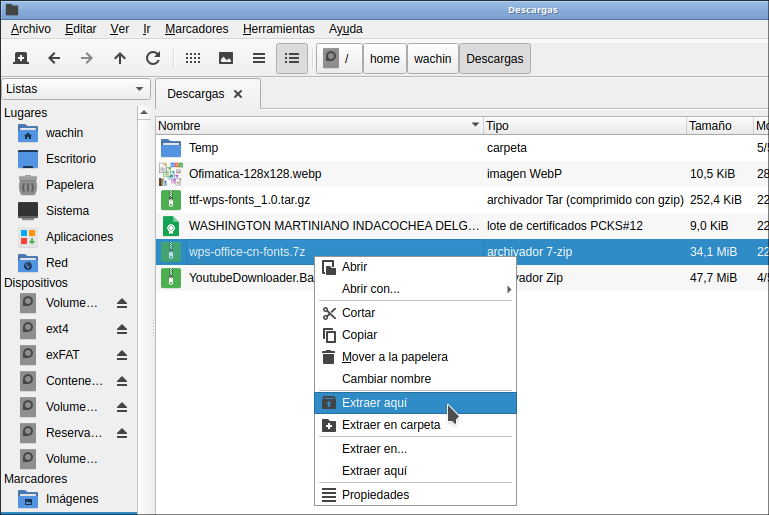

# 📦 PCManFM-QT - Extract Here with Engrampa

If you're using **PCManFM-QT** on Debian 12 or any other Linux distribution and the **"Extract Here"** option doesn't work as expected (especially for `.zip` files), this guide will help you fix it by integrating **Engrampa** into the right-click context menu of `pcmanfm-qt`.

This method adds two new contextual actions:
- **Extract Here**
- **Extract to Folder**

The second one creates a new folder named after the archive file before extracting, avoiding clutter in your current directory.


---

# In Debian, the non-free repository is not enabled by default – enable it

`unrar-free` has limitations with certain `.rar` files, especially modern ones. The `unrar` package (from non-free repositories) offers better support. If you don't have the `non-free` repository enabled, edit your `sources.list`:

## Using nano to edit sources.list
Enter this command in the terminal:

```bash
sudo nano /etc/apt/sources.list
```

Make sure you have something like this:

```bash
deb http://deb.debian.org/debian/ bookworm main contrib non-free
```

If not, as shown in the image below:


Add it like this:


Save and close the file, then refresh the repositories.

If you don't know how to use nano, see the following guide:

**How to use nano in the Linux terminal to edit text files**  
[https://facilitarelsoftwarelibre.blogspot.com/2024/08/como-usar-nano-en-linux.html](https://facilitarelsoftwarelibre.blogspot.com/2024/08/como-usar-nano-en-linux.html)

## Using Gedit to edit sources.list
Alternatively, if you prefer, you can use Gedit, which usually allows these operations from the terminal. Just replace the command with:

```bash
sudo gedit /etc/apt/sources.list
```

You can also try other text editors, although some — like Kate — often do not allow such actions.

--- 


---

## ✅ Install Required Tools

`pcmanfm-qt` relies on external tools to handle extraction tasks. Make sure you have them installed:

```bash
sudo apt update
sudo apt install unzip unrar xz-utils p7zip-full engrampa pcmanfm-qt
```

| Package        | Purpose |
|----------------|---------|
| `unzip`        | Extract `.zip` archives |
| `p7zip-full`   | Support for `.7z`, `.rar`, etc. |
| `engrampa`     | Archive manager used in MATE desktop (used here for extraction) |

---

## 🚀 Quick Installation Script

To install both custom actions automatically, run the following commands in a terminal (like Konsole or GNOME Terminal):

```bash
mkdir -p ~/.local/share/file-manager/actions/
cd /tmp
git clone https://github.com/wachin/PCManFM-engrampa-Extract-Here
cd PCManFM-engrampa-Extract-Here
cp *.desktop ~/.local/share/file-manager/actions/
cd && echo "God bless you"
```

> ⚠️ After running this script, restart `pcmanfm-qt` (close and reopen) or your graphical session if the options don’t appear immediately.

### ✅ What You’ll Get

After installation:

- Right-click on any compressed file (`.zip`, `.tar.gz`, `.rar`, etc.)
- Two new options will appear:
  - **Extract Here**
  - **Extract to Folder**

Both use **Engrampa**, respecting your system language and showing appropriate icons if available:



---

## 🔍 Line-by-Line Explanation

| Command | Description |
|--------|-------------|
| `mkdir -p ~/.local/share/file-manager/actions/` | Creates the folder where `pcmanfm-qt` looks for custom actions |
| `cd /tmp` | Changes to the temporary directory |
| `git clone https://github.com/wachin/PCManFM-engrampa-Extract-Here` | Clones the repository containing the `.desktop` action files |
| `cd PCManFM-engrampa-Extract-Here` | Enters the cloned folder |
| `cp *.desktop ~/.local/share/file-manager/actions/` | Copies the custom actions to the correct location |
| `cd && echo "God bless you"` | Returns to home directory and prints a friendly message 😊 |

---

## 🛠️ Manual Installation (Optional)

If you prefer to do everything manually for verification or learning purposes, follow these steps:

### 📁 Step 1: Create the Actions Folder

```bash
mkdir -p ~/.local/share/file-manager/actions
```

---

### 📄 Step 2: Create `engrampa-extract-here.desktop`

Create the file:

```bash
nano ~/.local/share/file-manager/actions/engrampa-extract-here.desktop
```

Paste this content:

```ini
# Extract Here - Supports multiple languages
[Desktop Entry]
Type=Action
Tooltip[es]=Extraer el archivo comprimido aquí usando Engrampa
Tooltip[en]=Extract the archive here using Engrampa
Tooltip[fr]=Extraire l'archive ici avec Engrampa
Tooltip[de]=Archiv hier mit Engrampa entpacken
Tooltip[it]=Estrarre l'archivio qui con Engrampa
Tooltip[pt]=Extrair o arquivo aqui com o Engrampa

Name[es]=Extraer aquí
Name[en]=Extract Here
Name[fr]=Extraire ici
Name[de]=Hier entpacken
Name[it]=Estrai qui
Name[pt]=Extrair aqui

Icon=archive-extract

Profiles=profile-zero;

[X-Action-Profile profile-zero]
MimeTypes=application/zip;application/x-rar;application/vnd.rar;application/x-rar-compressed;application/x-tar;application/x-bzip2;application/x-7z-compressed;application/x-java-archive;application/x-deb;application/x-cd-image;application/x-xz-compressed-tar;application/gzip;application/x-lzma-compressed-tar;application/x-lz4-compressed-tar;application/vnd.debian.binary-package;

Exec=engrampa --extract-here %u

Name[es]=Extraer a la carpeta actual
Name[en]=Extract to current folder
Name[fr]=Extraire dans le dossier actuel
Name[de]=In aktuellen Ordner entpacken
Name[it]=Estrai nella cartella corrente
Name[pt]=Extrair na pasta atual
```

Save and close (`Ctrl+O`, `Enter`, `Ctrl+X` in nano).

---

### 📄 Step 3: Create `engrampa-extract-to-folder.desktop`

Create the file:

```bash
nano ~/.local/share/file-manager/actions/engrampa-extract-to-folder.desktop
```

Paste this content:

```ini
# Extract to Folder - Supports multiple languages
[Desktop Entry]
Type=Action
Tooltip[es]=Extraer el archivo comprimido en una carpeta con su nombre usando Engrampa
Tooltip[en]=Extract the archive into its own folder using Engrampa
Tooltip[fr]=Extraire l'archive dans un dossier portant son nom avec Engrampa
Tooltip[de]=Archiv in eigenem Ordner mit gleichem Namen entpacken
Tooltip[it]=Estrarre l'archivio in una cartella con lo stesso nome
Tooltip[pt]=Extrair o arquivo em uma pasta com o mesmo nome

Name[es]=Extraer en carpeta
Name[en]=Extract to Folder
Name[fr]=Extraire dans un dossier
Name[de]=In Ordner entpacken
Name[it]=Estrai in una cartella
Name[pt]=Extrair em pasta

Icon=folder-new

Profiles=profile-zero;

[X-Action-Profile profile-zero]
MimeTypes=application/zip;application/x-rar;application/vnd.rar;application/x-rar-compressed;application/x-tar;application/x-bzip2;application/x-7z-compressed;application/x-java-archive;application/x-deb;application/x-cd-image;application/x-xz-compressed-tar;application/gzip;application/x-lzma-compressed-tar;application/x-lz4-compressed-tar;application/vnd.debian.binary-package;

Exec=engrampa --extract %u

Name[es]=Extraer en su propia carpeta
Name[en]=Extract to its own folder
Name[fr]=Extraire dans son propre dossier
Name[de]=In eigenen Ordner entpacken
Name[it]=Estrai nel proprio folder
Name[pt]=Extrair na própria pasta
```

Save and close.

---

## 🌐 What Each Field Does

| Field | Description |
|-------|-------------|
| `# Comment` | Only visible when editing the file |
| `Name[xx]` | Name shown in the context menu based on the system language |
| `Tooltip[xx]` | Tooltip explaining what the action does |
| `Exec=` | The command executed when selecting the action |
| `MimeTypes=` | List of supported file formats |

---

## ✅ Final Result

After creating the files:

- Restart `pcmanfm-qt` (close and reopen)
- Or log out and back in if the changes aren't visible

You should now see:

- **Right-click → Extract Here**
- **Right-click → Extract to Folder**

These actions use **Engrampa**, supporting multiple languages and icon themes.

---

## ✅ Bonus Tip: Contributing

If you want others to contribute translations or improvements, feel free to add

```markdown
## 🤝 Contributions Welcome!

Feel free to submit pull requests or issues. If you'd like to translate this tool into another language, just open an issue or PR.
```

---

## 🙏 Gratitude

Thank you for using this tool.
**God bless you.**
